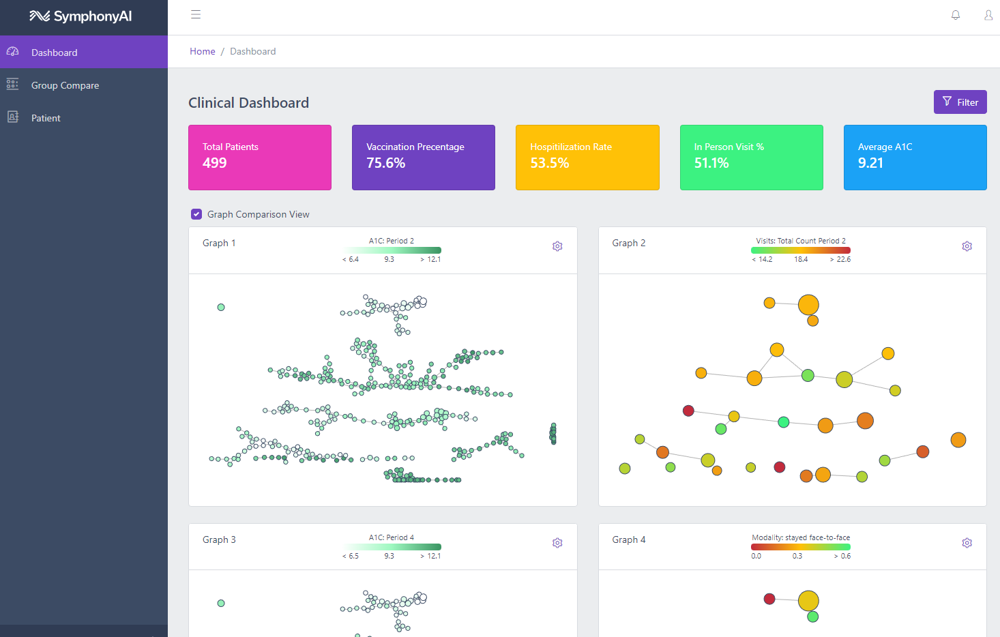

# VA Health
Master application for a REST api to the Eureka SDK and Vue.js based frontend

## api-flask
* Install required libraries
```bash
cd api-flask
pip install -r requirements.txt
```
* Set necessary environment variables in `api-flask/.env`
* Do **NOT** use spaces for the values
```properties
EUREKA_USER="firstname.lastname@symphonyai.com"
EUREKA_PASS="my_password"
AYASDI_APISERVER="https://platform.ayasdi.com/workbench/"
SOURCE_NAME="iris.csv"
FLASK_APP="app.py"
FLASK_DEBUG="1"
SOURCE_NAME_HOLDOUT="va_health_test.csv"
NETWORK_NAME="OAA_1"
```

For local development, this script will start up the flask server
`scripts\api-run.sh`

## frontend-vue
Web application integrating bootstrap based coreui with [Vue](https://vuejs.org/). Initial scafold done with Vue CLI. The project can be deployed as a [docker](https://docs.docker.com/install/) container



## Integration and Links

* [Vue cli](https://cli.vuejs.org/) used to generate this project
* [Style Guide](https://vuejs.org/v2/style-guide/) for Vue. Attempting to follow as best as possible
* [CoreUI Bootstrap](https://coreui.io) theme
* [Bootstrap-Vue](https://bootstrap-vue.org/) components
* [Vue Router](https://router.vuejs.org/) for view management
* [Vuex](https://vuex.vuejs.org/) for state management
* [vue-mobile-detection](https://github.com/ajerez/vue-mobile-detection) for checking mobile state
* [axios](https://github.com/axios/axios) as http client
* [Highcharts](https://www.highcharts.com) as graphing library
* [Highcharts Vue](https://github.com/highcharts/highcharts-vue) Vue wrapper for Highcharts
* [jsonplaceholder](https://jsonplaceholder.typicode.com/) for sample table data

## Project setup

* Install a [nodejs](https://nodejs.org/en/download/) runtime is installed (LTS)

```
npm install
```

### Compiles and hot-reloads for development
```
npm run serve
```

* The server will be running on [http://localhost:3000](http://localhost:3000)

### Compiles and minifies for production
```
npm run build
```

## Docker Container Running, Exporting

* Inside the `scripts` folder are all the bash scripts for building, running and exporting containers

* Make sure the api and frontend images are built with `api-build.sh` and `frontend-build.sh`

* Run the containers with `run-all.sh` or individually with `api-run.sh` and `frontend-run.sh`

> Make sure there is a .env file with the environment variables for the api conatiner to read. `.env` can be in the `api-flask` folder or the `scripts` folder

> The frontend container script checks to see if the api container is running and gets the ip address of the container. This address is injected as the environment variable `API_ADDRESS`

* Stop all the containers with `stop-all.sh`

* Build the tar files with `save-tar.sh`

* Load the save file with `load-tar.sh`

## Testing api-flask in [Postman](https://www.postman.com/downloads/)

TODO

* Import the environment
* Import the collection
